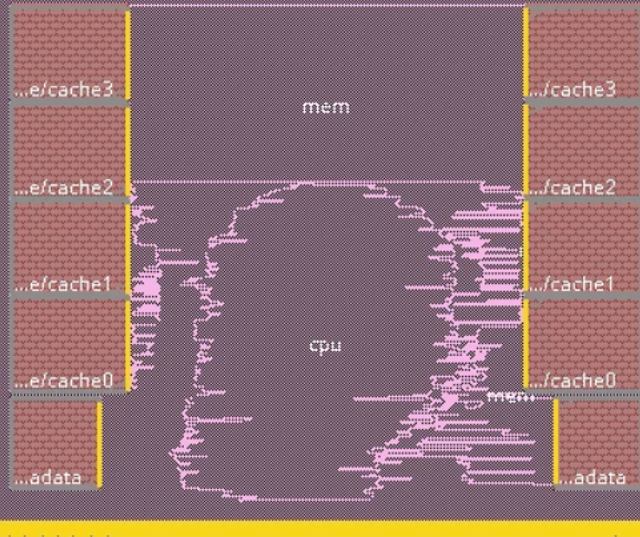
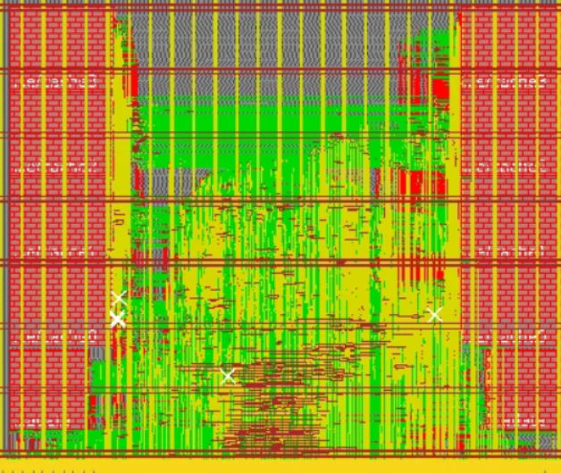

# RISC-V 3-Stage CPU Core

A fully functional 3-stage pipelined RISC-V CPU implementation in Verilog. This project implements a complete RISC-V instruction set architecture processor with memory hierarchy, cache system, and comprehensive test infrastructure.

## Physical Design
Total area of 2000 × 2400 µm. I-cache SRAMs on the left, D-cache SRAMs on the right, CPU logic in the center. Each cache uses one 64×32 metadata SRAM and four 256×32 data banks.

  
  

## Overview
This is a 3-stage pipelined RISC-V processor core that supports the RV32I base instruction set. The processor features:

- 3-stage pipeline: Fetch, Decode/Execute, Writeback
- Complete RISC-V RV32I instruction set support
- Direct-mapped instruction and data cache
- Memory management unit with partial load/store support
- Comprehensive test suite with RISC-V ISA compliance tests

## Architecture

The CPU implements a classic 3-stage pipeline:

1. **Fetch Stage**: Instruction fetch from memory/cache
2. **Decode/Execute Stage**: Instruction decoding, ALU operations, memory access
3. **Writeback Stage**: Register file updates

## Core Components

### CPU Core (`Riscv151.sv`)

The main processor module implementing the 3-stage pipeline. Handles instruction flow, hazard detection, and pipeline control.

### ALU (`ALU.sv`)

Arithmetic Logic Unit supporting all RISC-V arithmetic and logical operations including:

- Addition, subtraction
- Bitwise operations (AND, OR, XOR)
- Shift operations
- Comparison operations

### Control Unit (`Control.sv`)

Generates control signals for instruction execution, including:

- ALU control signals
- Register file read/write enables
- Memory access control
- Branch and jump control

### Register File (`RegFile.sv`)

32-entry register file with dual read ports and single write port, implementing the RISC-V register specification (x0-x31).

### Memory System

- **Cache** (`Cache.sv`): Instruction and data cache
- **Memory** (`Memory151.sv`): Main memory controller
- **Partial Load/Store**: Handles byte and halfword memory operations

## Configuration Files

- `sim-rtl.yml`: RTL simulation configuration
- `sim-gl-syn.yml`: Gate-level simulation (post-synthesis)
- `sim-gl-par.yml`: Gate-level simulation (post-place-and-route)
- `syn.yml`: Synthesis configuration
- `par.yml`: Place and route configuration
- `sky130.yml`: SkyWater 130nm PDK configuration
